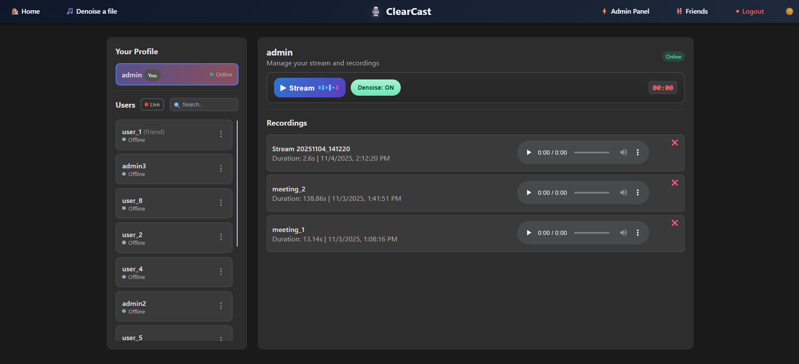

# ClearCast: Real-time Audio Streaming with Denoising

Stream audio to your friends with AI-powered noise removal using DeepFilterNet2.



## What it does

- Uses DeepFilterNet2 for the actual denoising.
- Stream your mic audio to friends in real-time (with optional denoising)
- Upload audio files for denoising
- Friend system with requests
- See who's live streaming
- All streams get saved automatically
- Admin panel for managing users and permissions

## Available Tools & Services

ClearCast provides a comprehensive suite of audio processing tools accessible via REST API:

### 1. **File Denoising Service**
   - Remove background noise from audio files using DeepFilterNet2
   - Optional volume boost (2x-5x) after denoising
   - Supports MP3, WAV, M4A, and FLAC formats
   - Real-time processing status tracking

### 2. **Vocal Separation Service**
   - Extract vocals or instrumentals from audio files using Demucs
   - Separate audio into vocals, drums, bass, and other instruments
   - High-quality stem isolation powered by state-of-the-art source separation

### 3. **Audio Boost Service**
   - Amplify audio volume with customizable boost levels (2x-5x)
   - Maintains audio quality while increasing loudness
   - Perfect for quiet recordings or low-volume files

### 4. **Speaker Extraction Service**
   - Isolate and extract a specific speaker's voice from multi-speaker audio
   - Upload a reference sample of the target speaker
   - Uses advanced speaker recognition (ECAPA-VOXCELEB) and separation (SepFormer)
   - Optional volume boost for extracted audio

### 5. **Real-time Audio Streaming**
   - WebRTC-based live audio streaming with friends
   - Real-time noise reduction during streaming
   - Automatic recording of all streams
   - Presence tracking to see who's online and streaming

All services are accessible through both the web interface and RESTful API endpoints. See `API/API_DOCUMENTATION.md` for detailed API usage.

## Tech Stack

Django + Django Channels + WebRTC + Redis + DeepFilterNet2

The audio processing runs server-side with configurable chunk sizes and overlap for smooth crossfading.

## Setup

**Requirements:**
- Python 3.8+
- Redis
- GPU recommended but not required

**Quick start:**

```bash
# Clone and install
git clone https://github.com/FarshadAmiri/Realtime_Denoising.git
cd Realtime_Denoising
pip install -r requirements.txt

# Setup database
python manage.py migrate
python manage.py createsuperuser

# Start Redis (separate terminal)
redis-server

# Run server
python manage.py runserver
```

## Configuration

You can tweak these in your environment:

- `AUDIO_CHUNK_SECONDS`: Chunk size for processing (default: 2.0)
- `AUDIO_OVERLAP_SECONDS`: Overlap for smooth crossfade (default: 0.5)
- `REDIS_HOST` / `REDIS_PORT`: Redis connection